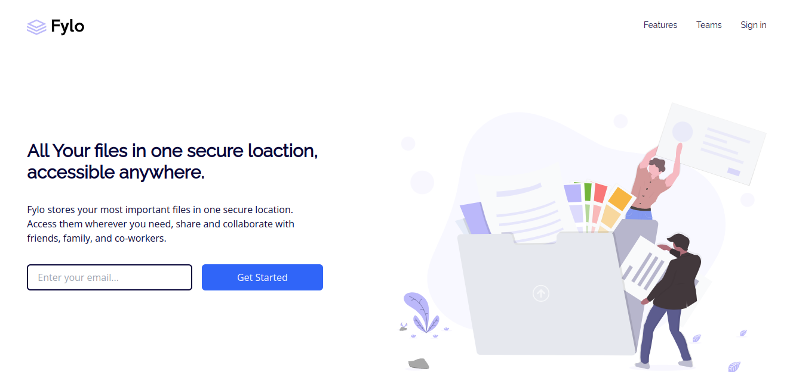

# Frontend Mentor - Fylo landing page with two column layout solution

This is a solution to the [Fylo landing page with two column layout challenge on Frontend Mentor](https://www.frontendmentor.io/challenges/fylo-landing-page-with-two-column-layout-5ca5ef041e82137ec91a50f5). Frontend Mentor challenges help you improve your coding skills by building realistic projects. 

## Table of contents

- [Overview](#overview)
  - [The challenge](#the-challenge)
  - [Screenshot](#screenshot)
  - [Links](#links)
- [My process](#my-process)
  - [Built with](#built-with)
  - [What I learned](#what-i-learned)
  - [Continued development](#continued-development)
- [Author](#author)

**Note: Delete this note and update the table of contents based on what sections you keep.**

## Overview

### The challenge

Users should be able to:

- View the optimal layout for the site depending on their device's screen size
- See hover states for all interactive elements on the page

### Screenshot

### Links

- Solution URL: [Code](https://github.com/joe801/fylo)
- Live Site URL: [Live](https://fylo.joecrypt.repl.co/)

## My process

### Built with

- Semantic HTML5 markup
- CSS custom properties
- Flexbox
- CSS Grid
- Mobile-first workflow
- Tailwind CSS

### What I learned

I learnt how to use Tailwind css as this is my first tailwind css project

**Note: Delete this note and the content within this section and replace with your own learnings.**

### Continued development

I hope to learn more of Tailwind Css

## Author

- Website - [joecrypt](https://www.joecrypt.ml)
- Frontend Mentor - [@joe801](https://www.frontendmentor.io/profile/joe801)
- Twitter - [@Joecrypt_](https://www.twitter.com/Joecrypt_)

